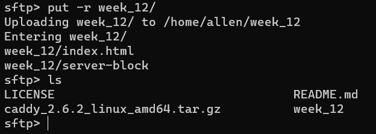
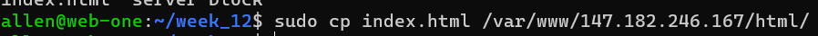

# ACIT 2420 Linux Week 12 Lab

Completed by Hao Li and Melody

## This README.MD guides how to do the following:

1. Installing nginx.
2. Setting up server and server block.
3. Using sftp to tansfer your files from host-machine to a server
4. Setting up friewall using DO Firewall

## Resources/Technologies Used

- WSL - Windows Subsystem for Linux (Ubuntu)
- DigitalOcean Droplets
- Windows Terminal (with Administrative Privileges)

## Prerequisites and Assumptions (DigitalOcean and WSL setup)

**Note:** The following video is assumed to be watched. The video includes specific commands when setting up DigitalOcean Droplets. The setup instructions below are to be done once the user has watched the video.

Follow along the embedded video to setup [DigitalOcean Droplets](https://vimeo.com/758870226/f75da348fc?embedded=true&source=video_title&owner=17609105)

**Note:**
Ensure to name the two droplets: **web-one** These will be the hostnames for your servers. These servers must have root privileges login to web-one to install nginx and the swich back to WSL

## WSL Setup

1. Install WSL on the host machine with the following command: `wsl --install -d Ubuntu`
2. As root in **WSL**, create a regular user with the following command: `useradd -ms /bin/bash`
3. Login as the newly created regular user

## 1. Installing nginx

1. Before you start installing, make sure you run the command to check update

```
sudo apt update && sudo apt upgrade
```


2. After updating and upgrading run the command below to install nginx:

```
sudo apt install nginx
```


## 2. Setting up server and server block.

1. Switch back to WSL and make a new dir in home dir called week_12 this will save html file and server-block file which will upload to server
   

2. Create a simple, but complete HTML document to serve. Your file should be named **index.html**
   
   

3. Make a server block file use command below

```
sudo vim filename
```


and then save the content


4. Upload your files to your server and move them to the appropriate directories.
   I used sftp to transfer all my files:

i: To connect to remote server, run command:

```
sftp -i ~/.ssh/publickey username@remote-server-IP-address
```


ii: To upload folder you downloaded from the repo, in sftp, run command:

```
put -r folder-name
```




Now connect to your web-one server


**Note:** make a directory for your index.html file


iii: Move files to appropriate directories




Check


**Note:** you can create a soft link to your new server block in sites-enabled use command:

```
sudo ln -s /etc/nginx/sites-available/your_ip /etc/nginx/sites-enabled/
```


**test your nginx configuration**


**Start or restart your service**


**Check to see if your document is being served by visiting your servers ip address**


## 3. Setup a firewall using DO Cloud Firewall Allow incoming HTTP and SSH connections.

1. click create button on the top in DO like the graph below and clik Cloud Firewalls


2. For the type make sure you have both SSH and HTTP chosen


3. Apply to Droplets


4. Check if the firewall made successfully


**Note:** After setting up your firewall ensure that you can still connect to your server via ssh and HTTP. You should still be able to connect to your server via ssh and visit the ip address in the browser.

